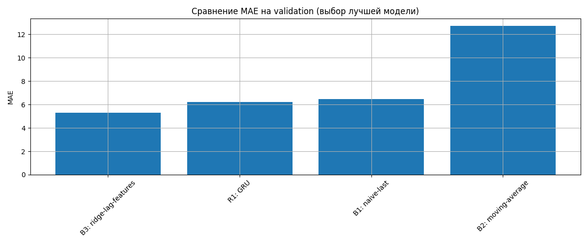
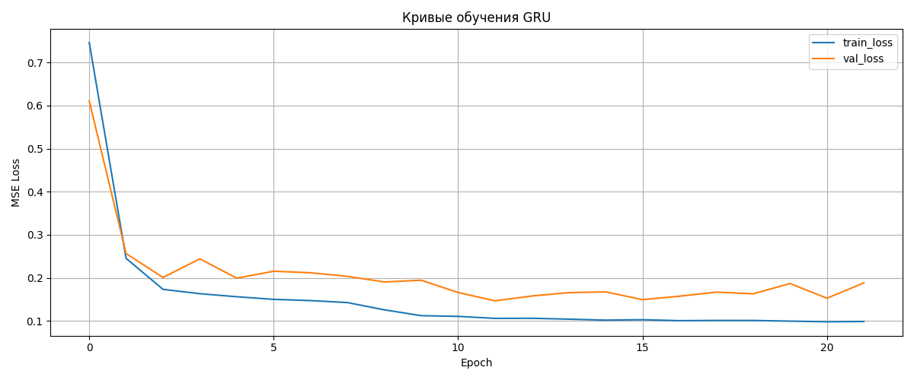
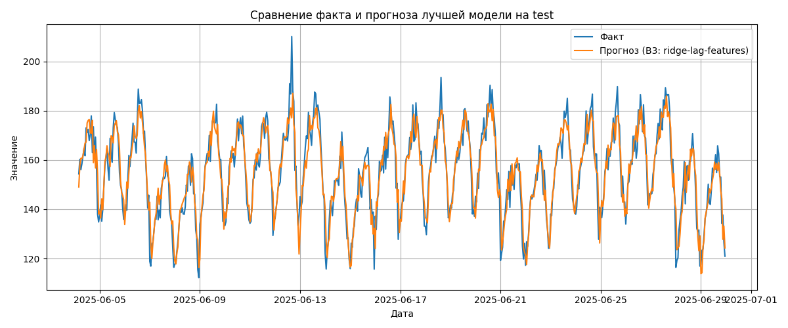

# Отчёт по домашнему заданию HW12

## 1. Введение
Цель работы: освоить корректную валидацию временных рядов, построение лаговых и rolling-признаков, сравнение базовых подходов с рекуррентной моделью GRU.

## 2. Данные
Использован датасет `S12-hw-dataset.csv`.  
- Количество наблюдений: [вставить число]  
- Диапазон дат: [вставить]  
- Пропуски: [вставить]  
- График ряда (см. `artifacts/figures/series_split.png`)

## 3. Подходы
- **B1 (naive-last)** – прогноз равен последнему наблюдению.  
- **B2 (moving-average)** – прогноз = скользящее среднее за окно 7 дней.  
- **B3 (ridge-lag-features)** – линейная модель с регуляризацией на основе лаговых, rolling- и календарных признаков.  
- **R1 (gru-forecast)** – GRU на оконном представлении ряда.

## 4. Эксперименты
Все эксперименты проведены на одинаковом временном разбиении:  
- Train: [даты]  
- Validation: [даты]  
- Test: [даты]  

Результаты сведены в таблицу `artifacts/runs.csv`.

### 4.1. Сравнение на валидации

### 4.2. Обучение GRU

### 4.3. Финальный прогноз лучшей модели на тесте

## 5. Выводы
- Лучшая модель по валидационной MAE – [B3/R1] с MAE = [значение].  
- GRU показал [лучшие/худшие] результаты по сравнению с линейными baseline.  
- Случайное разбиение привело бы к утечке информации из будущего в обучающую выборку.  
- Все этапы воспроизводимы при фиксированном seed.

## 6. Артефакты
- `runs.csv` – полная таблица результатов.  
- `best_gru.pt` – сохранённая лучшая GRU.  
- `best_gru_config.json` – конфигурация лучшей GRU.  
- Графики в папке `artifacts/figures/`.